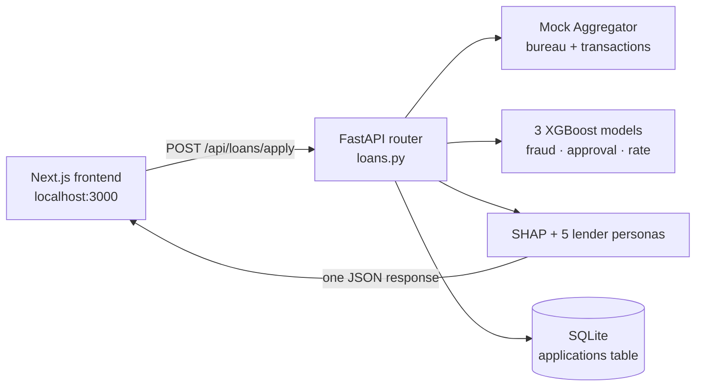

# CapitalMind AI — System Architecture

Every model, dataset, formula and endpoint in the running app, with exact numbers pulled from
the trained artifacts — plus a clear line between what's real and what's simulated for the demo.

## Contents

1. [Overview](#1-overview)
2. [Data sources](#2-data-sources)
3. [Feature engineering](#3-feature-engineering)
4. [The three trained models](#4-the-three-trained-models)
5. [Explainability (SHAP)](#5-explainability-shap)
6. [Mock 1033-style aggregator](#6-mock-1033-style-aggregator)
7. [Recommendation system — 5 lender personas](#7-recommendation-system--5-lender-personas)
8. [Bias / fairness audit](#8-bias--fairness-audit)
9. [API reference](#9-api-reference)
10. [Database](#10-database)
11. [Frontend](#11-frontend)
12. [Request lifecycle](#12-one-request-start-to-finish)
13. [Real vs. simulated](#13-real-vs-simulated--for-qa)

---

## 1. Overview

Two independent processes talking over HTTP: a **Next.js 16** frontend (port 3000, fully
client-rendered — no server-side data fetching) and a **FastAPI** backend (port 8000) that owns
three trained XGBoost models, a SQLite database, and a mock data-aggregator module. The frontend
never talks to a model directly — every prediction, explanation, credit pull and offer ranking
happens server-side in one `POST /api/loans/apply` call, and the frontend just renders whatever
JSON comes back.



## 2. Data sources

Both real, both public, neither synthetic.

| Dataset | Source | Size | Used for |
|---|---|---|---|
| HMDA 2023 loan-level data | CFPB / FFIEC Data Browser API, 9 states (VT, DE, WY, ND, SD, MT, RI, AK, DC), `actions_taken=1,2,3,4,5` | 206,810 rows × 99 cols | Approval + interest-rate models |
| ULB/Worldline credit card transactions | OpenML dataset 1597 (the standard Kaggle fraud benchmark), Sept. 2013, European cardholders | 284,807 rows × 31 cols, 492 confirmed frauds (0.17%) | Fraud detection model + mock aggregator's sampled "bank transactions" |

Raw files live at `backend/data/raw/` (gitignored, ~145MB combined) and are re-fetchable via
`backend/download_data.sh`.

Approval-model training uses `action_taken ∈ {1,2,3}` only (originated / approved-not-accepted /
denied) — `4` (withdrawn) and `5` (incomplete) are excluded because they aren't a lender credit
decision, leaving **166,780** decisioned applications.

The interest-rate model further restricts to `action_taken=1` (originated) with a parseable
numeric rate between 0–20%, leaving **120,025** rows — HMDA reports "Exempt" or blank for a
meaningful share of originations.

## 3. Feature engineering

`backend/ml/data_prep.py` — shared by training and live inference.

HMDA reports several fields as bucketed strings rather than numbers. The same parsing functions
run at training time and at request time, so a live application is encoded identically to what
the model was fit on.

| Field | Raw HMDA form | Parsed to |
|---|---|---|
| `debt_to_income_ratio` | `"<20%"`, `"20%-<30%"`, `"30%-<36%"`, `"42"`, `"50%-60%"`, `">60%"`, `"Exempt"` | Bucket midpoint (15 / 25 / 33 / 42 / 55 / 65) or exact value; "Exempt" → NaN |
| `applicant_age` | `"<25"`, `"35-44"`, `">74"`, `"8888"` | Bucket midpoint (22 / 39.5 / 78); "8888" (N/A) → NaN |
| `total_units` | `"1"`–`"4"`, `"5-24"`, `">149"` | Direct value or bucket midpoint (14.5…160) |

**16 features** reach the models — 8 numeric (`loan_amount`, `loan_to_value_ratio`, `income`,
`debt_to_income_ratio`, `property_value`, `loan_term`, `applicant_age_numeric`,
`total_units_numeric`) and 8 categorical, passed to XGBoost as native pandas `category` dtype
with `enable_categorical=True` (`loan_type`, `loan_purpose`, `lien_status`, `occupancy_type`,
`derived_dwelling_category`, `applicant_credit_score_type`, `construction_method`, `state_code`).

> **Deliberately excluded:** `derived_race`, `derived_sex`, `derived_ethnicity` are never model
> inputs (fair-lending best practice). They're kept alongside predictions purely so the
> bias-audit module can test the model's *outcomes* against them — see [§8](#8-bias--fairness-audit).

## 4. The three trained models

All XGBoost, all trained from `backend/ml/train_*.py`, artifacts in `backend/models/`.

### 1 · Loan approval — real

`XGBClassifier` · 300 trees, max_depth=5, learning_rate=0.05, subsample/colsample=0.8 · target:
`action_taken ∈ {1,2}` → 1 (approved), `=3` → 0 (denied) · 80/20 stratified split, seed 42

- Test ROC-AUC: **0.897**
- Test accuracy: **88.7%**
- Training rows: **166,780**

### 2 · Interest rate — real

`XGBRegressor` · 400 trees, max_depth=5, learning_rate=0.05 · target: reported `interest_rate` on
originated loans only · same feature set as the approval model

- Test MAE: **0.69 points**
- Test R²: **0.548**
- Training rows: **120,025**

### 3 · Fraud detection — real

`XGBClassifier` · 300 trees, max_depth=5 · `scale_pos_weight=577.3` to counter the 0.17% fraud
rate · features: `V1`–`V28` (PCA components), `Amount`, `Time` · target: `Class`

- Test ROC-AUC: **0.983**
- Average precision: **0.866**
- Training rows: **284,807**

## 5. Explainability (SHAP)

`backend/ml/explain.py`

Every approval and interest-rate prediction is paired with a `shap.TreeExplainer` call on that
exact model. The explainer returns one SHAP value per feature for the single applicant row; the
backend sorts by absolute magnitude and returns the top 5 as
`{feature, value, impact, direction}`. A positive value pushes the prediction up (higher approval
odds, or a higher rate); negative pushes it down — that's the blue/red split in the frontend's
"why" charts. This runs per-request, not pre-computed, so the explanation is always for the
specific applicant, not a global feature-importance ranking.

## 6. Mock 1033-style aggregator

`backend/app/aggregator_mock.py` — **mock**. Real bureau/bank APIs need paid enterprise contracts
an MVP doesn't have.

Everything here is **deterministic per applicant**: the applicant's email is SHA-256 hashed to a
seed, so the same applicant always gets the same bureau, score, and transaction sample — a re-run
for a demo is reproducible, not random each time.

1. **Consent token** — `issue_consent_token()` mints a scoped token (`accounts:read`,
   `transactions:read`, `credit_report:read`), styled after what a real CFPB §1033 aggregator
   (Plaid, Finicity) returns.
2. **Bureau selection** — `seed % 3` picks Equifax, Experian, or TransUnion.
3. **Score generation** — `base = 680 + 25·log1p(income/50) − 18·leverage`, where leverage is loan
   amount ÷ income (capped at 10), plus Gaussian noise (σ=35), clipped to 300–850. Higher income
   relative to the loan requested nudges the score up; heavier leverage pulls it down.
4. **Bank transactions** — 25 rows are sampled (seeded, without replacement) from the *real*
   ULB/Worldline transaction dataset and fed to the fraud model, standing in for "the applicant's
   linked bank account history."

**Important asymmetry:** HMDA discloses *which* scoring model was used
(`applicant_credit_score_type`) but never the raw score itself — that's a real privacy constraint
in the public HMDA data, not a corner cut here. So the mock bureau's numeric score is shown to the
applicant as context, but the *trained* approval/rate models only ever consume the score-*type*
code (mapped from the chosen bureau: Equifax→1, Experian→2, TransUnion→6), exactly as HMDA
discloses it.

## 7. Recommendation system — 5 lender personas

`backend/ml/personas.py` — **simulated business logic** over a real risk core.

One shared, HMDA-trained risk core (models 1 & 2) gets re-priced and re-thresholded per lender —
real banks' underwriting models aren't public, so this mirrors how actual marketplaces (Even,
LendingTree) layer partner business rules over a shared score they don't fully control.

| Lender | Risk appetite | Min. approval prob. | Rate margin | Max loan | Commission |
|---|---|---|---|---|---|
| North Star National Bank | Conservative | 0.65 | −0.15pt | $750k | 90bps |
| Meridian Credit Union | Conservative | 0.60 | −0.35pt | $500k | 60bps |
| Harbor Point Financial | Balanced | 0.45 | +0.10pt | $1.0M | 110bps |
| Summit Direct Lending | Growth | 0.30 | +0.55pt | $400k | 140bps |
| Beacon NBFC Partners | Growth | 0.20 | +1.10pt | $250k | 175bps |

For each applicant: a lender is included only if `approval_probability ≥ min_approval_proba`
**and** `loan_amount ≤ max_loan_amount`. Its offered rate is
`model_predicted_rate + rate_margin` (floored at 1.0%). Monthly payment uses the standard
amortization formula over the applicant's chosen term. Offers are sorted lowest-rate-first; if no
lender's thresholds are cleared, the applicant sees an empty, explained result rather than a
forced offer.

## 8. Bias / fairness audit

`backend/ml/bias_audit.py` — **real**, run once against the approval model's 33,356-row held-out
test set, using fairlearn.

| Attribute | Demographic parity diff. | Equalized odds diff. | Flag |
|---|---|---|---|
| Race | 20.3 pts | 17.6 pts | ⚠️ review |
| Sex | 9.6 pts | 11.6 pts | ✅ ok |
| Ethnicity | 14.2 pts | 16.8 pts | ⚠️ review |

Groups with fewer than 30 test examples are excluded per attribute to avoid noisy rates. A gap
over 10 points on demographic parity is auto-flagged "review." This is computed **once**,
offline, against the fixed test set (not per live request) and served as a static report at
`GET /api/bias/report` — it's a model-level audit, not a per-applicant check.

## 9. API reference

| Endpoint | What it does |
|---|---|
| `POST /api/loans/apply` | Runs the full pipeline (aggregator → fraud → approval → rate → personas → SHAP), persists to SQLite, returns the combined result |
| `GET /api/loans/apply/{id}` | Re-fetches a stored application's full response by ID |
| `GET /api/loans/recent` | Last 25 applications (summary columns) for the History page |
| `POST /api/aggregator/consent` | Issues a mock consent token standalone (also called internally by `/apply`) |
| `GET /api/aggregator/credit-report` | Mock bureau pull standalone |
| `GET /api/aggregator/transactions` | Mock bank-transaction sample standalone |
| `GET /api/bias/report` | The cached fairlearn audit ([§8](#8-bias--fairness-audit)) for the Fairness Dashboard |
| `GET /api/health` | Model test-metrics snapshot, used as a startup/liveness check |

## 10. Database

SQLite at `backend/data/app.db` — one table.

```sql
CREATE TABLE applications (
  id TEXT PRIMARY KEY,                    -- uuid4
  created_at TEXT NOT NULL,               -- ISO-8601 UTC
  applicant_name TEXT NOT NULL,
  applicant_email TEXT NOT NULL,          -- also the aggregator's seed key
  state_code TEXT NOT NULL,
  loan_amount REAL NOT NULL,
  property_value REAL NOT NULL,
  annual_income REAL NOT NULL,
  approved INTEGER NOT NULL,
  approval_probability REAL NOT NULL,
  predicted_base_interest_rate REAL NOT NULL,
  fraud_risk_level TEXT NOT NULL,
  bureau TEXT NOT NULL,
  credit_score INTEGER NOT NULL,
  offers_count INTEGER NOT NULL,
  response_json TEXT NOT NULL              -- full response, replayed by GET /apply/{id}
);
```

## 11. Frontend

Next.js 16, App Router, all client components — no server-side data fetching.

| Route / component | Role |
|---|---|
| `/` (`page.tsx`) | LoanForm → submits → renders ResultPanel in place; no page navigation on submit |
| `AIIntelligenceLayer.tsx` | The 1-row×5-column module grid: Fraud → Approval → Rate → Recommendation → Bias, in that fixed order |
| `ShapChart.tsx` | Recharts horizontal bar, blue=increases / red=decreases, used for both approval and rate explanations |
| `CreditReportCard.tsx` / `OffersList.tsx` | Render the mock bureau report and the ranked lender table |
| `/history` | Table from `GET /api/loans/recent` |
| `/fairness` + `FairnessChart.tsx` | Bar chart of selection rate by group per attribute, from `GET /api/bias/report` |
| `lib/api.ts` | Typed fetch client — every backend response type is mirrored in TypeScript here |

## 12. One request, start to finish

What happens between clicking "Submit application" and seeing a result:

1. **LoanForm** posts the form JSON to `POST /api/loans/apply`
2. Router hashes the applicant's email → issues a mock consent token → pulls a bureau credit
   report and 25 sampled bank transactions
3. **Fraud model** screens those 25 transactions, returns a risk level (low/medium/high)
4. DTI and LTV are computed from the raw form inputs; the 16-feature row is built with the
   bureau's score-type code included
5. **Approval model** predicts a probability; **SHAP** explains it
6. **Interest-rate model** predicts a base rate; **SHAP** explains it
7. The 5 lender personas filter/price against that probability and rate → ranked offer list
8. The cached bias report's flagged attributes are attached as a summary note (not recomputed)
9. Everything is written to SQLite under a new UUID, and returned as one JSON payload the
   frontend renders directly

## 13. Real vs. simulated — for Q&A

The honest map, so nobody gets caught off guard by a judge's question.

| | Real | Simulated |
|---|---|---|
| Training data | Both datasets (CFPB/HMDA, ULB fraud) are real, public, unmodified | — |
| Model predictions | Actual XGBoost inference on real trained weights | — |
| SHAP explanations | Actually computed per request from the real model | — |
| Bias audit numbers | Actually computed by fairlearn against real held-out predictions | — |
| Credit bureau connection | — | No live Experian/TransUnion/Equifax connection; score is formula-generated, bureau choice is a hash, shaped like a real bureau response |
| Bank transactions | Real transaction *records* (ULB dataset) | Not this applicant's actual transactions — sampled and attributed for the demo |
| 5 lender banks | Shared risk core is real | The banks themselves, their thresholds and margins are illustrative personas, not real partner contracts |
| 1033 consent flow | — | Token issuance is mocked; no real OAuth or aggregator (Plaid/Finicity) integration |
